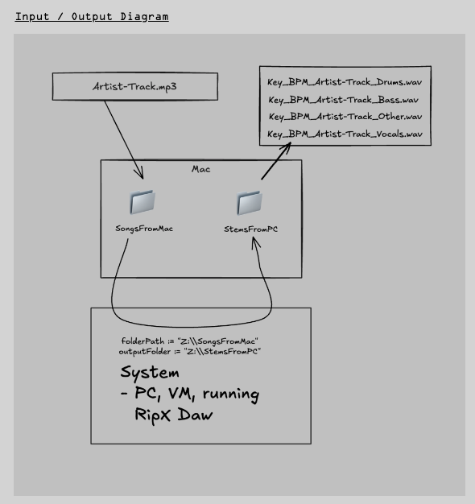

## Overview

This script is meant to run on a PC (Windows) running a virtual machine such Oracle VirtualBox. It automates the processing of audio files by detecting their key and tempo, renaming them accordingly, and running an AutoHotkey script to process the files with RipX DAW.
[Detailed on my website](https://www.denniscao.net/projects/drag-drop-stems?pageId=606c3433316d3167376c3166616633663431676d62373766346263656464346d)


## Features
- Watches a specified folder for new audio files.
- Detects the key and tempo of the audio files using `librosa`.
- Renames the files based on the detected key and tempo.
- Executes an AutoHotkey script to process the files with RipX DAW.


## Installation Instructions

1. **Clone the repository**:
    ```bash
    git clone https://github.com/dennisrcao/RipXDAW-DragDropAutomation-AudioStems.git
    ```

2. **Navigate to the project directory**:
    ```bash
    cd RipXDAW-DragDropAutomation-AudioStems
    ```

3. **Install the required Python packages**:
    ```bash
    pip install librosa watchdog
    ```

## Configuration

1. **Change the parameters in the script**:

    Open the `watchAndRename.py` file and update the `WATCHED_FOLDER` and `OUTPUT_FOLDER` variables to match your setup:

    ```python
    # watchAndRename.py

    # Define the folder to watch and output folder
    WATCHED_FOLDER = 'Z:\\SongsFromMac'
    OUTPUT_FOLDER = 'Z:\\StemsFromPC'
    ```

2. **Ensure AutoHotkey is installed**:
    Download and install AutoHotkey from [here](https://www.autohotkey.com/).

3. **Place the AutoHotkey script**:
    Ensure `RipX-script.ahk` is located in the same directory as the Python script.

## Usage

1. **Run the script**:
    ```bash
    python watchAndRename.py
    ```

2. **Drop audio files**:
    Drop audio files into the specified watched folder (this can be from a Mac or wherever). The script will automatically detect new files, process them, and rename them based on the detected key and tempo. It will also execute the AutoHotkey script to process the files with RipX DAW.

## Notes

- The script currently watches the folder specified by `WATCHED_FOLDER` for new files.
- The AutoHotkey script path is determined based on the current directory of the Python script. Ensure that the `RipX-script.ahk` file is in the same directory as the Python script.
- AutoHotkey is only available for Windows. This script will not work on macOS or Linux due to the dependency on AutoHotkey.

## Troubleshooting

- Ensure Python and the required packages (`librosa` and `watchdog`) are installed correctly.
- Make sure the paths specified in the script are correct and accessible.
- Verify that AutoHotkey is installed and the script path is correct.

## License

This project is licensed under the MIT License. See [LICENSE](LICENSE)
(c) 2024 Dennis Cao. [dennis-cao.net](https://dennis-cao.net)
